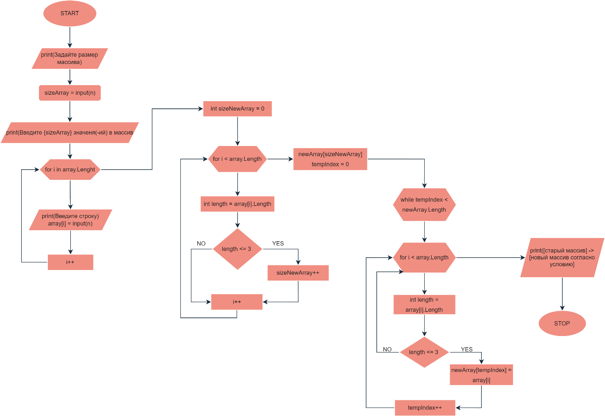
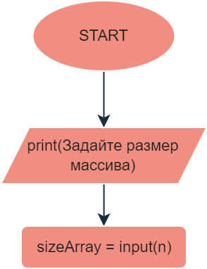
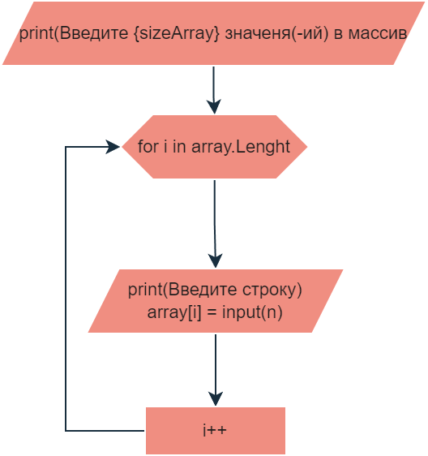
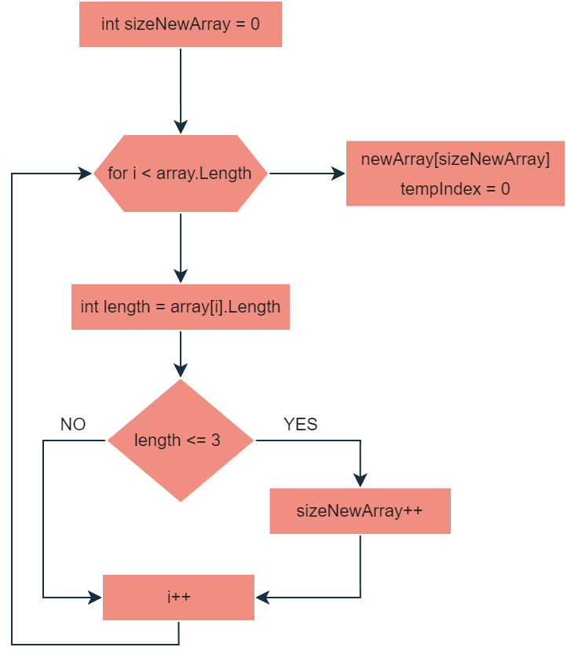
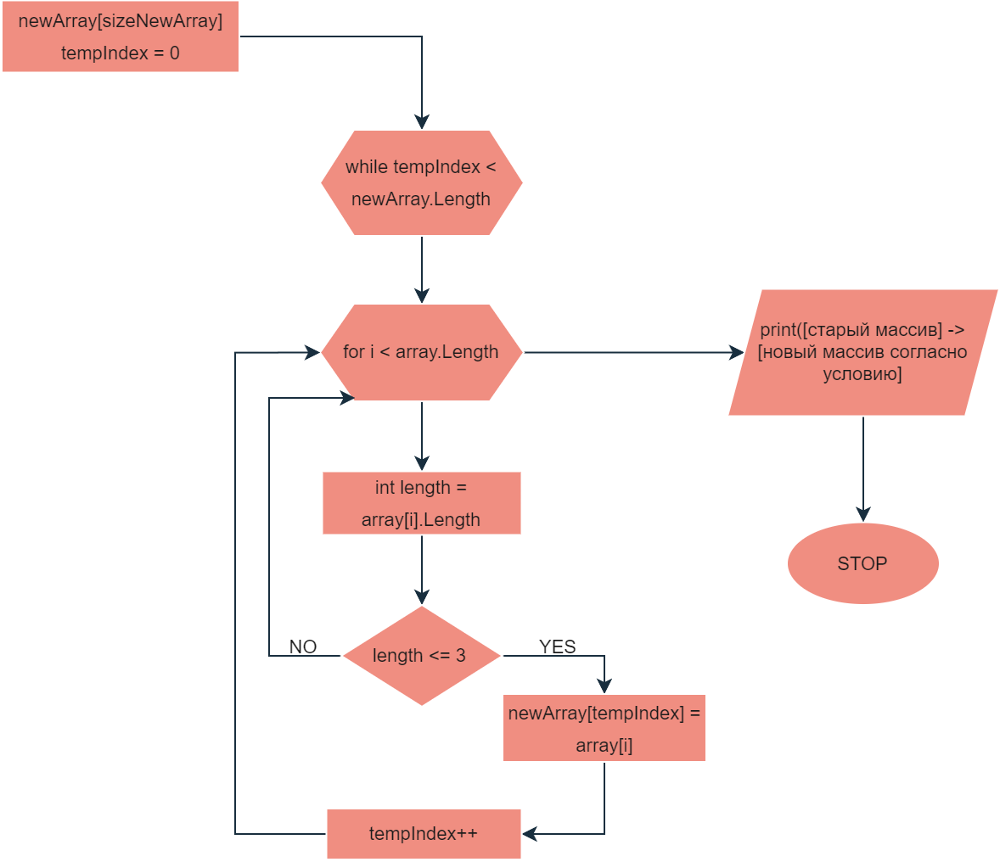

# Итоговая контрольная работа по основному блоку

*Задача*:

Написать программу, которая из имеющегося массива строк формирует новый
массив из строк, длина которых меньше, либо равна 3 символам.
Первоначальный массив можно ввести с клавиатуры, либо задать на старте
выполнения алгоритма. При решении не рекомендуется пользоваться
коллекциями, лучше обойтись исключительно массивами.

## Описание решения задачи.

*Реализация решения выполнена на языке C#.*

При проектировании алгоритма, было принято решение о возможности
задавать размер и значения элементов массива путем ввода значений через
консоль.

Итоговая блок-схема работы алгоритма указана на изображении



Работа алгоритма можно разделить на 3 основные части:

1.  Объявление массива и занесение элементов через консоль

2.  Вычисление размера под новый массив

3.  Объявление нового массива и добавление в него N элементов, согласно
    условию поставленной задачи


## 1. Объявление массива и занесение элементов через консоль

В начале алгоритма пользователю предлагается задать собственный размер
массива. На основании введенного значения создается массив (проверку на
условие ввода числа не создавалась, так как этого не требуется в
задании).



```Console.Write("Задайте размер массива:");

int sizeArray = Convert.ToInt32(Console.ReadLine());

//Объявление массива и занесение элементов через консоль

string[] array = new string[sizeArray];
```


Затем пользователю предлагается заполнить массив. Алгоритм будет
отрабатывать цикл до тех пор пока пользователь не заполнит все элементы
в массиве, согласно его размеру.


```
Console.WriteLine($"Введите {sizeArray} значеня(-ий) в массив");

for (int i = 0; i < array.Length; i++)

{

    Console.WriteLine($"Введите строку ({i + 1}/{sizeArray})");

    array[i] = Console.ReadLine();

}
```
После завершения работы цикла массив будет заполнен элементами, которые
указаны пользователем.

## 2.  Вычисление размера под новый массив

Для того, чтобы прописать условие, при котором в новый массив будут
добавляться значения элементов из первого (значения элементов, у которых
длина символов меньше или равно трем символам) необходимо вычислить
размер второго массива.

В связи с тем, что В C# массивы имеют фиксированный размер и не могут
быть изменены после создания, необходимо первоначально вычислить размер
создаваемого массива. Затем объявить его уже с известным размером и уже
после можно будет добавлять значения в его элементы.

В связи с вышеизложенным необходимо создать новую переменную(пусть будет
sizeNewArray), которая будет хранить размер нового массива с исходным
значением 0. Затем, с помощью цикла for перебрать значения первого
массива и при условии, если длина значения элемента меньше или равно
трем, прибавить к переменной sizeNewArray + 1.

На выходе из цикла сформируем новый массив с нужным нам размером
(sizeNewArray)


```
// Вычисление размера под новый массив
int sizeNewArray = 0;
for (int i = 0; i < array.Length; i++)
{
    int length = array[i].Length;
    if (length <= 3)
    {
        sizeNewArray++;
    }
}
// Объявление нового массива
string[] newArray = new string[sizeNewArray];
```
Дополнительно в условии можно прописать проверку длины массива и
значение переменной sizeNewArray
```
****

    if (length <= 3)

    {

        sizeNewArray++;

        //Проверка длины элемента массива и значние переменной
sizeNewArray

        Console.WriteLine($"Длинна элемента {array[i]} = {length}.
Значение sizeNewArray = {sizeNewArray}");

    }

****
```
## 3.  Объявление нового массива и добавление в него N элементов, согласно условию поставленной задачи

На последим этапе необходимо присвоить значение элемента из первого
массива в элемент второго. Для того, чтобы элементы, с подходящим
условием присваивались по порядку необходимо :

1.  Пройтись по всем элементам первого массива с помощью цикла for.

2.  В цикле прописать условие: если значение элементов меньше или равно трем, тогда присвоить значение n элемента первого массива в n
    элемент второго массива.

3.  Чтобы происходило поэтапное заполнение нового массива необходимо
    перед циклом for добавить переменную в которой будет храниться номер
    индекса нового массива (например tempIndex = 0) а в условии после
    присвоения значений прибавить переменную tempIndex на единицу.

4.  Создать проверку, например, при помощи цикла while чтобы переменная
    tempIndex была меньше длины самого второго массива. в цикл while
    вложить цикл for и условие присваивания.

5.  Полученный результат оформить и вывести в консоль

6.  Завершить программу.



```
int tempIndex = 0;
// Добавление в новый массив N элементов, согласно условию
while (tempIndex < newArray.Length)
{
    for (int i = 0; i < array.Length; i++)
    {
        int length = array[i].Length;
        if (length <= 3)
        {
            newArray[tempIndex] = array[i];
            tempIndex++;
        }
    }
}
// Вывод в консоль
Console.Clear();
Console.WriteLine($"[{string.Join(", ", array)}] → [{string.Join(", ", newArray)}]");
```
